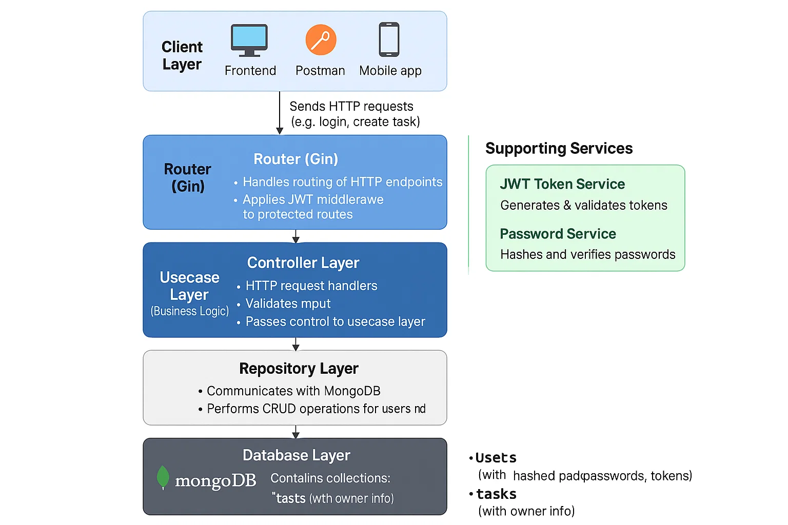

# 📋 Task Manager API

A robust and secure **Task Management REST API** built with **Golang**, **Gin**, and **MongoDB**, supporting full user authentication and task ownership validation. The system enforces access control with JWT tokens and supports both `USER` and `ADMIN` roles.

---

## 🚀 Features

- User Registration & Login
- Secure JWT Authentication (Access & Refresh Tokens)
- Password Hashing with bcrypt
- Role-based Access Control (`USER`, `ADMIN`)
- Only task owners can update/delete their tasks
- MongoDB-backed persistent storage
- Input validation with custom rules

---

## 🧰 Tech Stack

| Layer              | Technology                        |
|-------------------|------------------------------------|
| Language           | Go (Golang)                        |
| Web Framework      | Gin                                |
| Database           | MongoDB                            |
| Auth & Security    | JWT (Access/Refresh), bcrypt       |
| Validation         | go-playground/validator.v10        |
| Environment Config | OS environment variables           |

---

## 🧱 System Architecture

A modular, layered architecture for scalability and clean separation of concerns:

```

Client (Browser / Postman / Mobile App)
            │
            ▼
        Router (Gin)
            │
            ▼
Controller (HTTP Handlers)
            │
            ▼
Usecase (Business Logic)

    ┌───────┴────────┐
    ▼                ▼
JWT Service   Password Service
│
▼
Repository (MongoDB Operations)
│
▼
MongoDB (users, tasks)

```



---

## 📁 Project Structure

```

task-manager/
├── Delivery/
    ├── Controllers/
    ├── Routers/
    ├── main.go                    # Entry point
├── Domains/                    # Models & interfaces
├── Usecases/                   # Business logic layer
├── Repositories/              # MongoDB implementations
├── Intrastructures/           # JWT, password, config, middleware                  # API route definitions
├── go.mod / go.sum            # Go dependencies
└── .env                       # Environment configuration

````

---

## 🔐 Authentication Flow

1. **User logs in**
2. System verifies hashed password
3. Generates:
   - Access Token (short-lived)
   - Refresh Token (long-lived)
4. Access Token is required for all protected endpoints

Tokens are embedded with:
- `user_id`
- `username`
- `user_type` (`ADMIN` or `USER`)

---

## 📦 API Endpoints

### 👤 User APIs

| Method | Endpoint              | Description                      |
|--------|-----------------------|----------------------------------|
| POST   | `/api/users/register` | Register a new user              |
| POST   | `/api/users/login`    | Login and receive tokens         |
| GET    | `/api/users`          | Get all users                    |
| GET    | `/api/users/:id`      | Get user by ID                   |
| PUT    | `/api/users/:id`      | Update user                      |
| DELETE | `/api/users/:id`      | Delete user                      |

### 📌 Task APIs

| Method | Endpoint              | Description                          |
|--------|-----------------------|--------------------------------------|
| POST   | `/api/tasks`          | Create a new task                    |
| GET    | `/api/tasks`          | Get all tasks                        |
| GET    | `/api/tasks/:id`      | Get task by ID                       |
| PUT    | `/api/tasks/:id`      | Update task (only owner allowed)     |
| DELETE | `/api/tasks/:id`      | Delete task (only owner allowed)     |

---

## Input Validation

- **First Name / Last Name**: 3–50 characters
- **Username**: 5–25 characters
- **Task Title**: 4–50 characters
- **Task Description**: Max 100 characters
- **User Type**: Only `USER` or `ADMIN`

---

## ⚙️ Environment Variables

Create a `.env` file:

```env
MONGO_DB=mongodb://localhost:27017
SECRET_KEY=your_jwt_secret_key
````

---

## ▶️ Running the Project

### 1. Clone the Repository

```bash
git clone https://github.com/segnig/task-manager.git
cd task-manager
```

### 2. Set Up Environment

```bash
cp .env.example .env
# Edit .env with your Mongo URI and secret key
```

### 3. Run the App

```bash
go run Delivery/main.go
```

The API will be available at `http://localhost:8080`.

---

## 🧪 Example Protected Request (with Bearer Token)

```bash
curl -X POST http://localhost:8080/api/tasks \
  -H "Authorization: Bearer <your_access_token>" \
  -H "Content-Type: application/json" \
  -d '{"title":"Test Task", "description":"Example"}'
```

---

## 📄 License

MIT License. You are free to use, modify, and distribute this software.